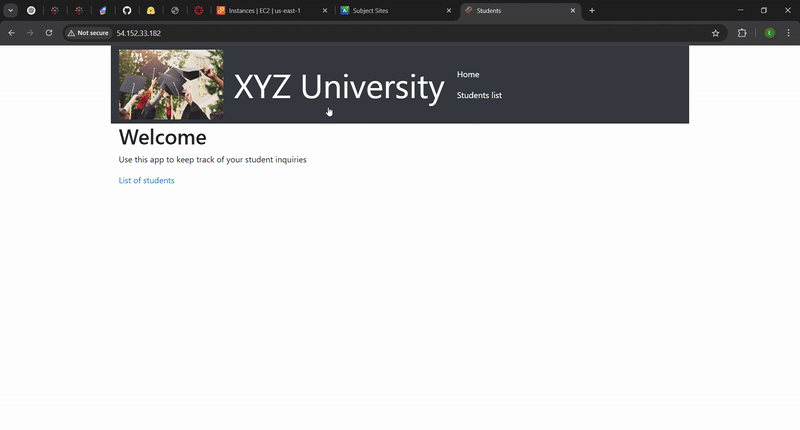
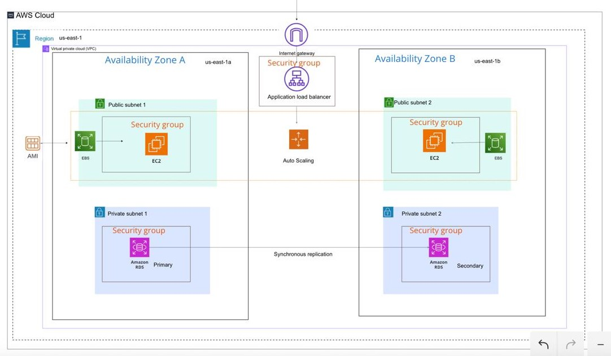

# Cloud Web Application for XYZ-University

This is a cloud-based **Student Records Web Application** built on AWS as part of my AWS Academy Capstone Project

It powers a student admissions system and showcases my ability to design and deploy secure, scalable cloud architectures using core AWS services.

---

## Demo

---

## What This Project Shows

 Deploying a web app on an EC2 instance  
 Hosting a MySQL database with Amazon RDS  
 Creating and isolating a VPC with subnets  
 Using Secrets Manager to secure database credentials  
 Setting up load balancing with an Application Load Balancer  
 Auto Scaling EC2 instances to handle load  
 Managing security groups for protection  
 Estimating cost with AWS Pricing Calculator  
 Load testing to ensure the app scales and performs

---

## Architecture Overview

The app runs in:
- **2 public subnets** for EC2 web servers
- **2 private subnets** for the RDS database
- A **load balancer** distributes traffic between EC2 instances
- **Secrets Manager** securely provides DB credentials
- The app was installed using a **user data script** at instance launch

---

## Technologies Used

- **AWS EC2** for virtual servers  
- **Amazon RDS (MySQL)** for the database  
- **AWS VPC** for networking  
- **Secrets Manager** for credentials  
- **Cloud9** for scripting and testing  
- **Node.js + Express** for the web application  
- **Shell scripting** to automate setup

---

## Project Files

| Folder              | Contents                                  |
|---------------------|-------------------------------------------|
| `architecture/`     | AWS architecture diagram                  |
| `screenshots/`      | UI screenshots & demo GIF                 |
| `video-demo/`       | Full video walkthrough (optional)         |
| `deployment-scripts/`| Shell scripts used for setup             |

---

## About Me

Hi, I’m **Emmanuel Ikhimwin** — currently pursuing a **Master’s in Artificial Intelligence** at **Western Sydney University**.  
This project helped me apply AWS services to build secure, scalable cloud applications.

---

## 📜 License

This project was built as part of AWS Academy coursework and is shared for learning and demonstration purposes.
